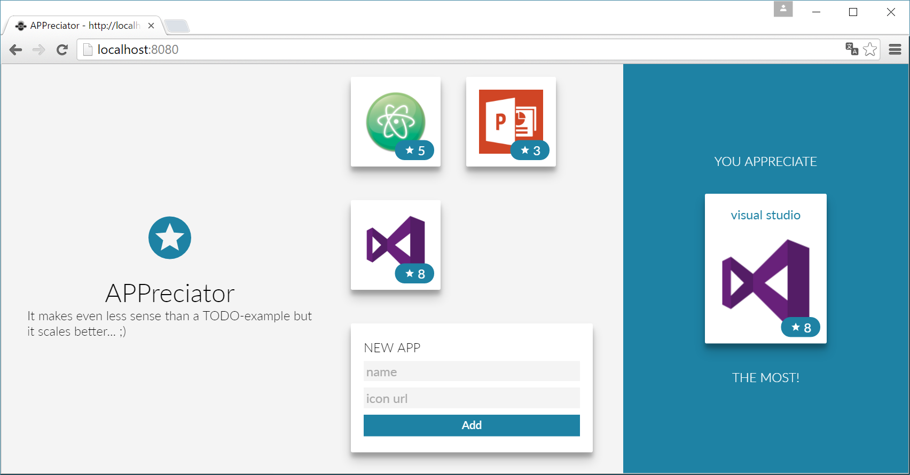

# APPreciator

> I built this app for [`Vue.js`](http://vuejs.org/) demo purposes for my talk "[Vue.js in a bigger Picture](https://onedrive.live.com/redir?resid=454656E6698FB906!147276&authkey=!ALFdpatjDRMzZ_U&ithint=file%2cpptx)". My intention was to build an app that is structured like a larger application to show how to accomplish real-world-scenarios with Vue.



The use of the app is pretty limited, but it uses [vue-loader](https://github.com/vuejs/vue-loader) for a clear separation of components and [vuex](https://github.com/vuejs/vuex) for state management.
You can add and up-vote your favorite applications and see what app you like the most - pretty useful... ;)

## (main) Technologies
- [Vue.js](http://vuejs.org/)
- [Stylus](http://stylus-lang.com/)
- [Typescript](https://www.typescriptlang.org/)

## [vue-devtools](https://github.com/vuejs/vue-devtools)
Use vue-devtools for time-travel debugging, it's a great experience!


## Build Setup ([docs for vue-loader](http://vuejs.github.io/vue-loader))

``` bash
# install dependencies
npm install

# serve with hot reload at localhost:8080
npm run dev

# build for production with minification
npm run build
```
